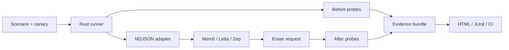

# ForgetProof

> Prove your AI forgot.

[English](README.md) · [简体中文](README.zh-CN.md)


ForgetProof is an open-source test runner for one uncomfortable question:

> When an AI memory system says “deleted”, can you show that the information is no longer observable?

It creates isolated synthetic canaries, asks a memory or Agent backend to erase them, checks raw and derived storage boundaries, and writes evidence that can be rerun locally or in CI.

## Why this exists

```text
DELETE 200 OK  !=  the canary is no longer observable
```

Memory systems may keep information in more than one place: the original record, a summary, an embedding, a graph node, a cache, or an Agent’s working context. ForgetProof makes those boundaries visible and reports what was actually checked.

It does not store your production memories. It tests a controlled namespace with synthetic data.

## How it works



The runner proves that the canary was visible before deletion, performs a scoped erase, waits for the backend to settle, and checks the target plus a control fixture afterward. Unsupported inspection is reported as `UNKNOWN`, never as a pass.

## Quickstart

Requirements: Rust stable and Python 3.11+.

```bash
cargo run -- adapters list
cargo run -- run examples/reference-clean.yml
```

The clean reference scenario exits `0` and writes a bundle under `.forgetproof/runs/`. Verify it:

```bash
cargo run -- verify .forgetproof/runs/<run-id>
open .forgetproof/runs/<run-id>/report.html
```

Now run the intentionally leaky backend:

```bash
cargo run -- run examples/reference-leaky.yml
```

It exits `1` because the raw item is deleted while a derived artifact remains observable. The report identifies the failing probe and profile.

## Conformance profiles

| Profile | Plain-English meaning |
| --- | --- |
| `FP-Object` | The erased target is gone from the configured recall and list probes. |
| `FP-Scope` | The target is gone while an unrelated control fixture remains. |
| `FP-Derived` | Observable summaries, indexes, graph artifacts, or other derivatives are gone or invalidated. |
| `FP-Agent` | An optional Agent query no longer leaks the unique canary. |

Results are `PASS`, `FAIL`, `SKIP`, `UNKNOWN`, or `ERROR`. There is no misleading single score.

## What ForgetProof can prove

| It can show | It cannot claim |
| --- | --- |
| A target was observable before erase. | Provider logs were deleted. |
| A configured API no longer returns the target. | Backups or physical storage were wiped. |
| A visible summary, graph, index, or Agent path still leaks it. | A model’s weights were unlearned. |
| A run’s evidence bundle was not modified after creation. | Anything outside the adapter’s observable boundary. |

## Supported adapters

The repository includes dependency-free Python adapters for Mem0, Letta, and Zep, plus clean and deliberately leaky reference backends. Remote access is opt-in:

```bash
MEM0_BASE_URL=https://... MEM0_API_KEY=... \
  cargo run -- run examples/mem0.yml --allow-network
```

Credentials stay in environment variables. Endpoint paths can be overridden with `endpoint_*` adapter settings for self-hosted or version-specific deployments.

## Evidence bundle

Each run emits a small, offline-readable evidence package:

```text
manifest.json       run metadata and protocol version
scenario.lock.json  redacted scenario snapshot
events.ndjson       ordered method-level journal
results.json        machine-readable assertions
report.html         single-file human report
junit.xml           CI test report
checksums.sha256    per-file integrity hashes
bundle.hash         hash of the checksum manifest
```

Payloads are redacted by default to hashes, lengths, and structural summaries. `--allow-network` does not change that privacy policy.

## Use it in CI

The repository provides a Docker-based GitHub Action. A scenario can fail a pull request when an erasure regression is detected and upload the evidence bundle for review.

```yaml
name: Memory erasure

on: [pull_request]

jobs:
  forgetproof:
    runs-on: ubuntu-latest
    steps:
      - uses: actions/checkout@v4
      - uses: Hughhhhcoder/ForgetProof@agent/forgetproof-v0.1
        with:
          scenario: examples/reference-clean.yml
```

## Adapter protocol

The Rust runner starts one adapter process per run and communicates over stdout using `forgetproof.adapter/v1alpha1` NDJSON. stdout is reserved for protocol frames; diagnostics go to stderr.

Supported methods are `hello`, `capabilities`, `prepare`, `ingest`, `settle`, `probe`, `erase`, `inspect`, `agent_query`, `cleanup`, and `close`. A third-party adapter only needs to implement this protocol and advertise its capabilities.

## Learn more

- [中文说明](README.zh-CN.md)
- [Scenario schema](schemas/scenario.schema.json)
- [Contributing guide](CONTRIBUTING.md) · [中文贡献指南](CONTRIBUTING.zh-CN.md)
- [Security policy](SECURITY.md) · [中文安全策略](SECURITY.zh-CN.md)
- [Code of conduct](CODE_OF_CONDUCT.md) · [中文行为准则](CODE_OF_CONDUCT.zh-CN.md)
- [Public conformance submissions](conformance/README.md)
- [Conformance matrix](site/index.html)

## Development

```bash
cargo fmt --all
cargo clippy --all-targets --all-features -- -D warnings
cargo test
PYTHONPATH=python python3 -m unittest discover -s python/tests -v
python3 -m compileall python
```

The default test suite is local and credential-free. Live Mem0, Letta, and Zep checks belong in a separately authorized workflow.

## License

Apache-2.0. See [LICENSE](LICENSE).
