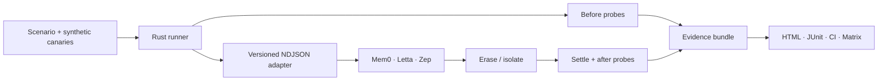

# MemoryProof

> Prove what your AI forgot.

[English](README.md) · [简体中文](README.zh-CN.md)

<p align="center">
  <a href="https://github.com/Hughhhhcoder/MemoryProof/actions/workflows/ci.yml?query=branch%3Amain"></a>
  <a href="https://hughhhhcoder.github.io/MemoryProof/"></a>
  <a href="https://github.com/Hughhhhcoder/MemoryProof/releases"></a>
  <a href="https://github.com/Hughhhhcoder/MemoryProof/blob/main/LICENSE"></a>
</p>

<p align="center">
  
  
  
  
  
</p>

<p align="center">
  🧪 <a href="#quickstart">Try it in 60 seconds</a> · 🔍 <a href="#the-proof-in-one-screen">See the proof</a> · 🧭 <a href="https://hughhhhcoder.github.io/MemoryProof/">Open the live matrix</a>
</p>


MemoryProof is an open-source **memory assurance** toolkit for AI agents. It tests a question that a successful `DELETE` response cannot answer:

> Can the information still be observed through any path the backend exposes?

It creates isolated synthetic canaries, runs deterministic before/after probes, checks raw and derived boundaries, and emits an offline evidence bundle that developers can review, verify, and run in CI.

> [!IMPORTANT]
> `DELETE 200 OK` is an API response. MemoryProof tests the stronger, observable claim: **the canary is no longer retrievable through the configured boundary**.

## Why MemoryProof?

Agent memory is rarely one table. A single fact can be copied into a raw record, summary, embedding, graph node, cache, block, or working context. A delete endpoint may remove one representation while another still answers a search query.

MemoryProof makes that gap concrete with a controlled experiment:

| 🧾 What an API may report | 🕳️ What can remain | 🔬 What MemoryProof records |
| --- | --- | --- |
| `DELETE 200 OK` | A summary still contains the canary | Deterministic pre/post probes |
| Raw row is gone | An index, vector, or graph edge still recalls it | Derived-artifact inspection |
| One block was detached | Another Agent path can still leak the fact | Optional black-box Agent query |
| “Delete all” was accepted | An unrelated control subject disappeared too | Isolation and scope assertions |

The goal is not to assign a vendor a simplistic score. The goal is to make **what was checked, what passed, and what cannot be observed** explicit.

## The proof in one screen



1. **Seed a canary** that is unique, synthetic, and safe to send to a test namespace.
2. **Prove the precondition**: the target canary is observable before deletion.
3. **Erase or isolate** only resources owned by this run.
4. **Wait for asynchronous writes** to settle; a timeout becomes `UNKNOWN`, not a false pass.
5. **Probe raw, derived, Agent, and control paths** with deterministic rules.
6. **Seal the evidence** with sorted SHA-256 checksums and a bundle hash.

## The difference it makes

|  | ❌ “Trust the endpoint” | ✅ MemoryProof |
| --- | --- | --- |
| Evidence | A green HTTP response | A portable bundle with events, results, report, JUnit, and hashes |
| Coverage | The object named in the delete call | Every observable boundary advertised by the adapter |
| Safety | A script may delete the wrong data | Synthetic canaries plus target/control isolation |
| Regression testing | A one-off manual check | A locked scenario in local runs and pull requests |
| Uncertainty | Missing APIs become “probably fine” | `UNKNOWN`, `SKIP`, and `OUT OF SCOPE` stay visible |

### A failure is a useful result

The repository includes a deliberately leaky backend. It deletes the raw item but leaves a derived artifact. MemoryProof must fail at the derived boundary:

```text
status: FAIL
profile: erasure.derived
probe: target-derived-after
reason: the unique canary is still observable in a derived artifact
```

This is the core experience: an ambiguous memory concern becomes a named, reproducible, reviewable regression.

## Quickstart

Requirements: Rust stable and Python 3.11+.

### Run from source

```bash
git clone https://github.com/Hughhhhcoder/MemoryProof.git
cd MemoryProof

cargo run -- adapters list
cargo run -- run examples/reference-clean.yml
```

The clean reference scenario exits `0` and writes a bundle under `.memoryproof/runs/`. Verify and open it offline:

```bash
cargo run -- verify .memoryproof/runs/<run-id>
open .memoryproof/runs/<run-id>/report.html       # macOS
# xdg-open .memoryproof/runs/<run-id>/report.html # Linux
```

Now run the intentionally leaky backend:

```bash
cargo run -- run examples/reference-leaky.yml
```

It exits `1`: the raw item disappears, but a derived artifact remains observable. That failure is expected and demonstrates the check is working.

### Use the released binary or container

Download a platform binary from [Releases](https://github.com/Hughhhhcoder/MemoryProof/releases), or run the GHCR image. Each binary archive includes the dependency-free Python adapter modules; if you keep them in a different location, set `MEMORYPROOF_ADAPTER_ROOT` to that archive's `python/` directory.

```bash
docker run --rm -v "$PWD":/workspace \
  ghcr.io/hughhhhcoder/memoryproof:1 \
  run /workspace/examples/reference-clean.yml \
  --output /workspace/.memoryproof/runs
```

For compatibility with the original v0.1 project, the `forgetproof` binary name and `forgetproof` Python import path remain available during the migration window.

## Suites and profiles

MemoryProof is an umbrella with two suites:

| Suite | What it answers | Profiles |
| --- | --- | --- |
| 🧹 **Erasure** | Did an owned memory boundary stop exposing the target? | `erasure.object`, `erasure.scope`, `erasure.derived`, `erasure.agent` |
| 🧱 **Isolation** | Can one subject be read without leaking another subject’s memory? | `isolation.read`, `isolation.search`, `isolation.agent` |

The human-facing legacy names `FP-Object`, `FP-Scope`, `FP-Derived`, and `FP-Agent` are accepted when loading v0.1 scenarios. New scenarios use the stable names above.

Every assertion is one of:

| Status | Meaning |
| --- | --- |
| `PASS` | The required observable check passed. |
| `FAIL` | A probe found the target, a forbidden derivative, or a scope violation. |
| `SKIP` | The selected profile is not required or is intentionally not executed. |
| `UNKNOWN` | The adapter cannot expose enough information to make the claim. |
| `ERROR` | The scenario, protocol, precondition, or execution failed. |

There is no aggregate score. A capability boundary should be readable, not averaged away.

## What it can—and cannot—prove

| ✅ It can show | 🚫 It does not claim |
| --- | --- |
| A target was observable before erase. | Provider logs were deleted. |
| A configured API no longer returns the target. | Backups or physical storage were wiped. |
| A visible summary, graph, index, or Agent path still leaks it. | A model’s weights were unlearned. |
| A control subject stayed intact—or was accidentally deleted. | Anything outside the adapter’s observable boundary. |
| The evidence bundle was not modified after creation. | The identity of the person who produced the bundle. |

These boundaries are part of the product, not a footnote. Reports explicitly separate **proved**, **not observed**, and **out of scope**.

## Supported adapters

| Adapter | Modes | Coverage in v1 |
| --- | --- | --- |
| `reference-clean` | local | Full erasure and isolation reference behavior |
| `reference-leaky` | local | Deliberate derived-artifact residue |
| `reference-overdelete` | local | Deliberate control-subject deletion |
| `mem0` | OSS / platform / cloud | Object, scope, search, optional raw/derived inspection; async settle |
| `letta` | self-hosted / cloud | Temporary Agent, core block, archival passage, scope delete, optional query |
| `zep` | self-hosted / cloud | Episode, temporary user/thread, user scope, search, graph inspection |

Remote access is opt-in. Credentials are read from environment variables and are never written into scenarios or evidence:

```bash
MEM0_BASE_URL=https://... MEM0_API_KEY=... \
  cargo run -- run examples/mem0.yml --allow-network
```

Adapters communicate with the Rust runner through the versioned `memoryproof.adapter/v1` NDJSON protocol. Third-party adapters can implement the same contract without linking to the Rust binary.

## Evidence you can review in a pull request

Each run emits an offline-readable package:

```text
manifest.json       format, run, adapter mode, protocol, and declared files
scenario.lock.json  redacted, frozen scenario snapshot
scenario.lock.yml   the same frozen snapshot in the requested YAML form
events.ndjson       ordered method journal with safe request IDs
results.json        machine-readable assertions and profile states
report.html         single-file bilingual report
junit.xml           CI-native test report
checksums.sha256    per-file SHA-256 integrity list
bundle.hash         hash of the checksum manifest
```

Use `memoryproof doctor --allow-network` only when a provider endpoint is
intentionally reachable, and use `memoryproof expand ... --allow-network` only
when probe generation is configured to call a non-loopback OpenAI-compatible
endpoint. The generated probes are frozen before a run; the model never makes
the final pass/fail decision.

By default, payloads are reduced to hashes, lengths, types, and safe structural summaries. `--allow-network` authorizes a remote backend; it does not disable redaction.

## GitHub Actions

The repository ships a Docker-based action that uploads the evidence bundle even when the test fails:

```yaml
name: Memory assurance

on:
  pull_request:

jobs:
  memoryproof:
    runs-on: ubuntu-latest
    steps:
      - uses: actions/checkout@v7
      - uses: Hughhhhcoder/MemoryProof@v1
        with:
          scenario: examples/reference-clean.yml
```

Use a leaky or vendor-specific scenario in a separate job when you want the PR to fail on a known regression. The action exposes `bundle-path`, `status`, and `exit-code` outputs and writes a short job summary.

## Scenario and adapter contract

The stable scenario API is `memoryproof.dev/v1`. A scenario contains:

- an adapter and non-sensitive configuration references;
- isolated target and control subjects;
- synthetic target/control fixtures;
- settle policy for asynchronous backends;
- an erase intent such as `object_delete` or `subject_erase`;
- deterministic probes and selected profiles;
- a privacy policy for redacted evidence.

The adapter protocol methods are `hello`, `capabilities`, `prepare`, `ingest`, `settle`, `probe`, `erase`, `inspect`, `agent_query`, `cleanup`, and `close`. stdout is reserved for protocol frames; adapter logs go to stderr. A capability that is not implemented must become `SKIP` or `UNKNOWN`, never a fabricated pass.

## Build and contribute

```bash
cargo fmt --all
CARGO_NET_OFFLINE=true CARGO_TARGET_DIR=/tmp/memoryproof-target \
  cargo clippy --workspace --all-targets --all-features -- -D warnings
CARGO_NET_OFFLINE=true CARGO_TARGET_DIR=/tmp/memoryproof-target \
  cargo test --workspace -- --test-threads=2
PYTHONPATH=python python3 -m unittest discover -s python/tests -v
```

Please read [CONTRIBUTING.md](CONTRIBUTING.md), [SECURITY.md](SECURITY.md), and their [中文版本](CONTRIBUTING.zh-CN.md) before opening a pull request. MemoryProof is Apache-2.0 licensed and follows the DCO sign-off workflow.

## Learn more

- 🌐 [Live Memory Assurance Matrix](https://hughhhhcoder.github.io/MemoryProof/)
- 🧪 [Public conformance evidence](conformance/README.md)
- 📐 [Scenario schema](schemas/scenario.schema.json)
- 🏗️ [Architecture and trust boundaries](docs/architecture.md) · [中文架构说明](docs/architecture.zh-CN.md)
- 🧭 [中文说明](README.zh-CN.md)
- 🤝 [Contributing](CONTRIBUTING.md) · [中文贡献指南](CONTRIBUTING.zh-CN.md)
- 🛡️ [Security policy](SECURITY.md) · [中文安全策略](SECURITY.zh-CN.md)
- 📜 [Changelog](CHANGELOG.md)
- 📦 [Releases](https://github.com/Hughhhhcoder/MemoryProof/releases)
- 🐳 [Container packages](https://github.com/Hughhhhcoder/MemoryProof/pkgs/container/memoryproof)

## Migration from ForgetProof

MemoryProof is the new umbrella name for the project formerly published as ForgetProof. The v0.1 evidence format and compatibility binary remain readable, while new scenarios and releases use `memoryproof.dev/v1` and the `memoryproof` command. If you have an old GitHub Action reference, update `Hughhhhcoder/ForgetProof@v0.1.0` to `Hughhhhcoder/MemoryProof@v1`; GitHub does not redirect Action references after a repository rename.
