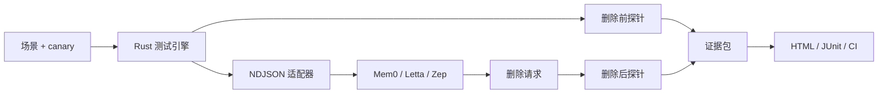
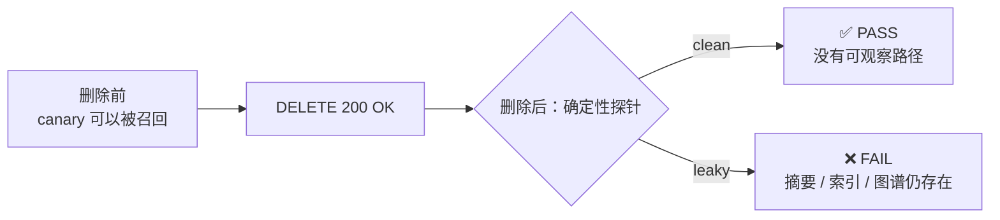

# ForgetProof

> 证明你的 AI 真的忘了。

[English](README.md) · [简体中文](README.zh-CN.md)

<p align="center">
  <a href="https://github.com/Hughhhhcoder/ForgetProof/actions/workflows/ci.yml?query=branch%3Amain"></a>
  <a href="https://hughhhhcoder.github.io/ForgetProof/"></a>
  <a href="https://github.com/Hughhhhcoder/ForgetProof/releases"></a>
  <a href="https://github.com/Hughhhhcoder/ForgetProof/blob/main/LICENSE"></a>
</p>

<p align="center">
  
  
  
  
</p>

<p align="center">
  🧪 <a href="#快速开始">60 秒试用</a> · 🔍 <a href="#30 秒看懂差异">查看证明效果</a> · 🌐 <a href="https://hughhhhcoder.github.io/ForgetProof/">打开在线矩阵</a>
</p>


ForgetProof 是一个开源测试工具，用来回答一个容易被忽略的问题：

> 当 AI 记忆系统说“已删除”时，你能不能证明这条信息已经无法被观察到？

它会创建隔离的合成 canary，让记忆系统或 Agent 执行删除，再检查原始存储和衍生存储边界，最后生成可以在本地或 CI 中重复执行的证据。

> [!IMPORTANT]
> `DELETE 200 OK` 只是 API 的响应。ForgetProof 检查的是更强的结论：**在可观察的路径上，canary 是否真的已经无法被召回**。

## 为什么需要它

```text
DELETE 200 OK  !=  canary 已经无法被召回
```

记忆系统可能把信息保存在多个地方：原始记录、摘要、向量、知识图谱节点、缓存，甚至 Agent 当前上下文。ForgetProof 会把这些边界显式展示出来，并只报告实际检查过的内容。

它不会保存你的生产记忆，只会在隔离命名空间中使用合成数据进行测试。

## 🧠 一眼看懂问题

| 后端可能说 | 实际可能还存在 | ForgetProof 检查 |
| --- | --- | --- |
| ✅ `DELETE 200 OK` | 📝 摘要里仍然包含 canary | 🔎 删除前后确定性探针 |
| ✅ 原始记录没了 | 🧭 索引、向量或图边仍然可以召回 | 🧬 衍生工件检查 |
| ✅ Agent 看不到某个 block | 💬 另一条 Agent 路径仍然泄露事实 | 🤖 可选黑盒 Agent 查询 |

目标不是惩罚能力不完整的后端，而是把边界变得清楚、可复现、诚实。

## 工作方式



测试引擎先证明 canary 在删除前确实可以被召回，然后执行范围受控的删除，等待后端稳定，最后检查目标 canary 和控制 canary。如果某个存储边界无法观察，结果会写成 `UNKNOWN`，不会被当成通过。

## 🔍 30 秒看懂差异

|  | 没有 ForgetProof | 使用 ForgetProof |
| --- | --- | --- |
| **证据** | 相信 `200 OK` | 📦 保存可验证的证据包 |
| **覆盖范围** | 只检查被删除的对象 | 🧠 检查可观察的原始记录、摘要、向量、图谱、缓存和 Agent 路径 |
| **回归测试** | 写一次性脚本 | 🔁 在 CI 中反复执行同一个锁定场景 |
| **不确定性** | 把缺少 API 当成“应该没问题” | ⚠️ 能力不足时明确报告 `UNKNOWN` |



### 失败本身就是价值

故意泄漏的参考后端是项目演示的一部分。它删除了原始记录，却留下衍生工件，因此 ForgetProof 必须在衍生层失败：

```text
status: FAIL
profile: FP-Derived
probe: target-derived-after
reason: 唯一 canary 仍然可以从衍生工件中被观察到
```

这就是产品承诺的缩影：把模糊的“记忆问题”变成有名称、可审阅、可复现的失败。

## 🚀 快速开始

需要 Rust stable 和 Python 3.11+。

可以按你的工作方式选择入口：

- 🛠️ **源码运行：** 使用 Rust stable 执行下面的命令。
- 📥 **下载二进制：** 从 [Releases](https://github.com/Hughhhhcoder/ForgetProof/releases) 下载 Linux、macOS 或 Windows 压缩包。
- 🐳 **Docker：** `docker run --rm -v "$PWD":/workspace ghcr.io/hughhhhcoder/forgetproof:v0.1.0 run /workspace/examples/reference-clean.yml --output /workspace/.forgetproof/runs`

```bash
cargo run -- adapters list
cargo run -- run examples/reference-clean.yml
```

clean 参考后端会以退出码 `0` 结束，并在 `.forgetproof/runs/` 下生成证据包。验证它：

```bash
cargo run -- verify .forgetproof/runs/<run-id>
open .forgetproof/runs/<run-id>/report.html
```

再运行故意留下衍生数据的后端：

```bash
cargo run -- run examples/reference-leaky.yml
```

它会以退出码 `1` 结束，因为原始记录虽然被删除，但衍生工件仍然可观察。报告会指出失败的探针和认证档案。

## 🏅 认证档案

| 档案 | 通俗解释 |
| --- | --- |
| `FP-Object` | 目标数据已经无法通过配置好的召回和列表探针找到。 |
| `FP-Scope` | 目标数据消失，同时不相关的控制数据仍然存在。 |
| `FP-Derived` | 可观察的摘要、索引、图谱工件和其他衍生数据已经消失或失效。 |
| `FP-Agent` | 可选的 Agent 查询不再泄露唯一 canary。 |

结果统一为 `PASS`、`FAIL`、`SKIP`、`UNKNOWN` 或 `ERROR`，不使用容易误导的单一总分。

## ✅ ForgetProof 能证明什么

| 它可以展示 | 它不会声称 |
| --- | --- |
| 目标数据在删除前确实可以被观察到。 | 服务商日志已经删除。 |
| 配置好的 API 不再返回目标数据。 | 备份或物理存储已经被擦除。 |
| 摘要、图谱、索引或 Agent 路径仍然泄露目标数据。 | 模型权重已经完成反学习。 |
| 证据包创建后没有被修改。 | 适配器观察边界之外的任何事情。 |

## 🔌 支持的适配器

仓库包含 Mem0、Letta 和 Zep 的无额外依赖 Python 适配器，以及 clean/leaky 两个参考后端。远程访问默认关闭，必须显式开启：

```bash
MEM0_BASE_URL=https://... MEM0_API_KEY=... \
  cargo run -- run examples/mem0.yml --allow-network
```

凭据只从环境变量读取。对于自托管或版本不同的部署，可以通过适配器配置中的 `endpoint_*` 覆盖接口路径。

## 📦 证据包

每次运行都会生成一个可以离线打开的小型证据包：

```text
manifest.json       运行元数据和协议版本
scenario.lock.json  脱敏后的场景快照
events.ndjson       按顺序记录的方法调用日志
results.json        机器可读的断言结果
report.html         单文件人类可读报告
junit.xml           CI 测试报告
checksums.sha256    每个文件的完整性哈希
bundle.hash         校验清单的哈希
```

默认只记录哈希、长度和结构摘要，不记录原始 payload。开启 `--allow-network` 不会改变这个隐私策略。

## 🤖 在 CI 中使用

仓库提供 Docker 版 GitHub Action。当遗忘回归测试失败时，它可以阻止 Pull Request，并上传证据包供审阅。

```yaml
name: Memory erasure

on: [pull_request]

jobs:
  forgetproof:
    runs-on: ubuntu-latest
    steps:
      - uses: actions/checkout@v4
      - uses: Hughhhhcoder/ForgetProof@v0.1.0
        with:
          scenario: examples/reference-clean.yml
```

## 🧩 适配器协议

Rust 测试引擎每次运行启动一个独立适配器进程，通过 stdout 使用 `forgetproof.adapter/v1alpha1` NDJSON 通信。stdout 只允许输出协议帧，诊断日志写入 stderr。

支持的方法包括 `hello`、`capabilities`、`prepare`、`ingest`、`settle`、`probe`、`erase`、`inspect`、`agent_query`、`cleanup` 和 `close`。第三方适配器只需要实现该协议并声明自己的能力。

## 🗺️ 继续阅读

- [English README](README.md)
- [场景 Schema](schemas/scenario.schema.json)
- [贡献指南](CONTRIBUTING.zh-CN.md) · [English contributing guide](CONTRIBUTING.md)
- [安全策略](SECURITY.zh-CN.md) · [English security policy](SECURITY.md)
- [行为准则](CODE_OF_CONDUCT.zh-CN.md) · [English code of conduct](CODE_OF_CONDUCT.md)
- [公开认证结果提交说明](conformance/README.zh-CN.md)
- [认证矩阵](site/index.html)
- [变更记录](CHANGELOG.zh-CN.md)
- [GHCR 容器镜像](https://github.com/Hughhhhcoder/ForgetProof/pkgs/container/forgetproof)

## 开发

```bash
cargo fmt --all
cargo clippy --all-targets --all-features -- -D warnings
cargo test
PYTHONPATH=python python3 -m unittest discover -s python/tests -v
python3 -m compileall python
```

默认测试完全在本地运行，不需要凭据。Mem0、Letta 和 Zep 的真实服务测试应该放在单独授权的工作流中。

## 许可证

Apache-2.0，详见 [LICENSE](LICENSE)。
