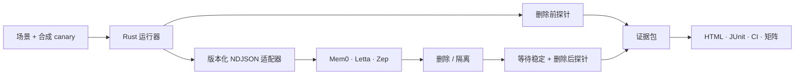

# MemoryProof

> 用证据证明 AI 忘记了什么。

[English](README.md) · [简体中文](README.zh-CN.md)

<p align="center">
  <a href="https://github.com/Hughhhhcoder/MemoryProof/actions/workflows/ci.yml?query=branch%3Amain"></a>
  <a href="https://hughhhhcoder.github.io/MemoryProof/"></a>
  <a href="https://github.com/Hughhhhcoder/MemoryProof/releases"></a>
  <a href="https://github.com/Hughhhhcoder/MemoryProof/blob/main/LICENSE"></a>
</p>

<p align="center">
  
  
  
  
  
</p>

<p align="center">
  🧪 <a href="#快速开始">60 秒上手</a> · 🔍 <a href="#一屏看懂证明过程">看懂证明过程</a> · 🧭 <a href="https://hughhhhcoder.github.io/MemoryProof/">打开在线矩阵</a>
</p>


MemoryProof 是面向 AI Agent 的开源 **Memory Assurance（记忆保证）** 工具。它验证一个成功的 `DELETE` 响应无法回答的问题：

> 通过后端暴露的其他路径，还能不能观察到这条信息？

它创建隔离的合成 canary，执行确定性的删除前后探针，检查原始与衍生数据边界，并输出可以离线审阅、校验和在 CI 中重复运行的证据包。

> [!IMPORTANT]
> `DELETE 200 OK` 只是 API 响应。MemoryProof 验证的是更强、但明确限定在可观察边界内的结论：**通过已配置的路径已经无法召回这条 canary。**

## 为什么需要 MemoryProof？

Agent 记忆很少只有一张表。一条事实可能被复制到原始记录、摘要、向量、图节点、缓存、block 或工作上下文里。删除接口可能只移除一种表示，而另一个搜索路径仍然可以回答相关问题。

MemoryProof 用一次受控实验把这个差距变得清晰可见：

| 🧾 API 可能报告 | 🕳️ 实际仍可能存在 | 🔬 MemoryProof 记录 |
| --- | --- | --- |
| `DELETE 200 OK` | 摘要里仍然包含 canary | 确定性的删除前/后探针 |
| 原始行已经消失 | 索引、向量或图边仍能召回 | 衍生工件检查 |
| 某个 block 已 detach | 另一条 Agent 路径仍然泄露事实 | 可选黑盒 Agent 查询 |
| “全部删除”已被接受 | 不相关的控制主体也被误删 | 隔离与范围断言 |

目标不是给供应商打一个容易误导的总分，而是把**检查了什么、通过了什么、哪些无法观察**讲清楚。

## 一屏看懂证明过程



1. **写入 canary**：它必须唯一、合成且适合发送到测试命名空间。
2. **证明前置条件**：删除前确实能观察到目标 canary。
3. **删除或隔离**：只操作本次运行拥有的资源。
4. **等待异步写入稳定**：超时会变成 `UNKNOWN`，不会被伪装成通过。
5. **检查原始、衍生、Agent 和控制路径**：使用确定性规则判定。
6. **封存证据**：用排序后的 SHA-256 清单和 bundle hash 固化结果。

## 它带来的实际差别

|  | ❌ “相信接口就好” | ✅ MemoryProof |
| --- | --- | --- |
| 证据 | 一个绿色的 HTTP 响应 | 包含事件、结果、报告、JUnit 和哈希的可携带证据包 |
| 覆盖范围 | 删除接口参数里的那个对象 | 适配器声明的每个可观察边界 |
| 安全性 | 一段脚本可能误删真实数据 | 合成 canary + 目标/控制隔离 |
| 回归测试 | 一次性的手工检查 | 本地和 Pull Request 中可重复运行的锁定场景 |
| 不确定性 | 缺少 API 就“默认没问题” | 保留 `UNKNOWN`、`SKIP` 和 `OUT OF SCOPE` |

### 失败也是有价值的结果

仓库包含一个故意泄漏的参考后端。它会删除原始项目，但留下衍生工件，因此 MemoryProof 必须在衍生边界失败：

```text
status: FAIL
profile: erasure.derived
probe: target-derived-after
reason: the unique canary is still observable in a derived artifact
```

这就是项目的核心体验：把模糊的“记忆可能没删干净”，变成可命名、可复现、可审阅的回归问题。

## 快速开始

要求：Rust stable、Python 3.11 及以上。

### 从源码运行

```bash
git clone https://github.com/Hughhhhcoder/MemoryProof.git
cd MemoryProof

cargo run -- adapters list
cargo run -- run examples/reference-clean.yml
```

clean 参考场景会以 `0` 退出，并把证据包写入 `.memoryproof/runs/`。可以离线校验并打开报告：

```bash
cargo run -- verify .memoryproof/runs/<run-id>
open .memoryproof/runs/<run-id>/report.html       # macOS
# xdg-open .memoryproof/runs/<run-id>/report.html # Linux
```

再运行故意泄漏的后端：

```bash
cargo run -- run examples/reference-leaky.yml
```

它会以 `1` 退出：原始项目消失了，但衍生工件仍可观察。这个失败是预期的，说明检查确实捕捉到了问题。

### 使用发行版二进制或容器

可以从 [Releases](https://github.com/Hughhhhcoder/MemoryProof/releases) 下载 Linux、macOS 或 Windows 二进制，也可以运行 GHCR 容器。每个平台压缩包都包含无额外依赖的 Python 适配器模块；如果把它们放在其他位置，请将 `MEMORYPROOF_ADAPTER_ROOT` 指向压缩包内的 `python/` 目录：

```bash
docker run --rm -v "$PWD":/workspace \
  ghcr.io/hughhhhcoder/memoryproof:1 \
  run /workspace/examples/reference-clean.yml \
  --output /workspace/.memoryproof/runs
```

为了兼容最初的 v0.1 项目，迁移窗口内仍保留 `forgetproof` 二进制名称和 `forgetproof` Python 导入路径。

## 套件与认证档案

MemoryProof 是一个包含两个套件的总项目：

| 套件 | 它回答的问题 | 档案 |
| --- | --- | --- |
| 🧹 **Erasure（遗忘）** | 一个受本次运行拥有的记忆边界是否不再暴露目标？ | `erasure.object`、`erasure.scope`、`erasure.derived`、`erasure.agent` |
| 🧱 **Isolation（隔离）** | 读取一个主体时，是否会泄露另一个主体的记忆？ | `isolation.read`、`isolation.search`、`isolation.agent` |

加载 v0.1 场景时仍接受 `FP-Object`、`FP-Scope`、`FP-Derived`、`FP-Agent` 这些旧名称；新场景使用上面的稳定名称。

每个断言只会有以下状态：

| 状态 | 含义 |
| --- | --- |
| `PASS` | 必需的可观察检查通过。 |
| `FAIL` | 探针找到了目标、禁止的衍生数据，或发现范围违规。 |
| `SKIP` | 当前档案不是必需项，或被明确跳过。 |
| `UNKNOWN` | 适配器没有暴露足够信息作出结论。 |
| `ERROR` | 场景、协议、前置条件或执行失败。 |

这里没有综合分数。能力边界应该被读懂，而不是被平均掉。

## 它能证明什么，不能证明什么

| ✅ 它可以说明 | 🚫 它不会声称 |
| --- | --- |
| 删除前确实能观察到目标。 | 供应商日志已经删除。 |
| 已配置 API 不再返回目标。 | 备份或物理存储已经擦除。 |
| 可观察的摘要、图、索引或 Agent 路径仍在泄漏。 | 模型权重已经完成反学习。 |
| 控制主体保持完整，或被意外误删。 | 适配器观察边界之外的任何事情。 |
| 证据包创建后没有被修改。 | 证据创建者的身份。 |

这些边界不是脚注，而是产品的一部分。报告会明确区分**已证明、未观察到和范围之外**。

## 适配器

| 适配器 | 模式 | v1 覆盖 |
| --- | --- | --- |
| `reference-clean` | 本地 | 完整遗忘和隔离参考行为 |
| `reference-leaky` | 本地 | 故意遗留衍生工件 |
| `reference-overdelete` | 本地 | 故意删除控制主体 |
| `mem0` | OSS / platform / cloud | 对象、范围、搜索、可选原始/衍生检查，以及异步稳定等待 |
| `letta` | self-hosted / cloud | 临时 Agent、核心 block、archival passage、范围删除、可选查询 |
| `zep` | self-hosted / cloud | episode、临时 user/thread、user 范围、搜索和图检查 |

访问远程后端必须显式授权。凭据只从环境变量读取，绝不会写入场景或证据包：

```bash
MEM0_BASE_URL=https://... MEM0_API_KEY=... \
  cargo run -- run examples/mem0.yml --allow-network
```

适配器通过版本化的 `memoryproof.adapter/v1` NDJSON 协议与 Rust 运行器通信。第三方适配器无需链接 Rust 二进制，也可以实现同一契约。

## 可以放进 Pull Request 审阅的证据

每次运行都会生成一个可离线打开的包：

```text
manifest.json       格式、运行、适配器模式、协议与声明的文件列表
scenario.lock.json  脱敏后的冻结场景快照
scenario.lock.yml   同一份冻结快照的 YAML 版本
events.ndjson       按顺序记录的方法级事件与安全的请求 ID
results.json        机器可读的断言与档案状态
report.html         单文件双语报告
junit.xml           CI 原生测试报告
checksums.sha256    每个文件的 SHA-256 完整性清单
bundle.hash         清单本身的哈希
```

只有在确实允许访问供应商 endpoint 时，才使用
`memoryproof doctor --allow-network`；只有在探针生成配置为访问非本机
OpenAI-compatible endpoint 时，才使用 `memoryproof expand ... --allow-network`。
生成的探针会在运行前冻结，最终 PASS/FAIL 判定不会交给模型。

默认情况下，内容会被缩减为哈希、长度、类型和安全的结构摘要。`--allow-network` 只授权访问远程后端，不会关闭脱敏策略。

## GitHub Actions

仓库提供一个 Docker Action，即使测试失败也会上传证据包：

```yaml
name: Memory assurance

on:
  pull_request:

jobs:
  memoryproof:
    runs-on: ubuntu-latest
    steps:
      - uses: actions/checkout@v7
      - uses: Hughhhhcoder/MemoryProof@v1
        with:
          scenario: examples/reference-clean.yml
```

如果希望某个已知回归阻断 PR，可以在独立 job 中运行 leaky 或供应商场景。Action 暴露 `bundle-path`、`status` 和 `exit-code` 输出，并在 Job Summary 中写入简要结果。

## 场景与适配器契约

稳定场景 API 是 `memoryproof.dev/v1`。一个场景包含：

- 适配器与非敏感配置引用；
- 隔离的目标主体和控制主体；
- 合成目标/控制 fixture；
- 异步后端的 settle 策略；
- `object_delete`、`subject_erase` 等删除意图；
- 确定性的探针与所选档案；
- 证据脱敏策略。

适配器协议方法包括 `hello`、`capabilities`、`prepare`、`ingest`、`settle`、`probe`、`erase`、`inspect`、`agent_query`、`cleanup` 和 `close`。stdout 只允许协议帧，适配器日志必须写 stderr。没有实现的能力必须报告 `SKIP` 或 `UNKNOWN`，不能伪造通过。

### 带凭据的供应商测试

仓库中的 `*-adapter-contract` 证据使用确定性的本地 mock。若要测试真实的 Mem0、Letta 或 Zep 部署，请使用可选的[带凭据供应商工作流](provider-conformance.zh-CN.md)。它从 GitHub Secrets 读取 API Key，强制使用 `--allow-network`，上传待审核 artifact，并且不会自动提交远程证据。

## 开发与贡献

```bash
cargo fmt --all
CARGO_NET_OFFLINE=true CARGO_TARGET_DIR=/tmp/memoryproof-target \
  cargo clippy --workspace --all-targets --all-features -- -D warnings
CARGO_NET_OFFLINE=true CARGO_TARGET_DIR=/tmp/memoryproof-target \
  cargo test --workspace -- --test-threads=2
PYTHONPATH=python python3 -m unittest discover -s python/tests -v
```

提交 Pull Request 前请阅读 [英文贡献指南](CONTRIBUTING.md)、[英文安全策略](SECURITY.md) 及其[中文版本](CONTRIBUTING.zh-CN.md)。MemoryProof 使用 Apache-2.0 许可证，并要求按 DCO 签署提交。

## 更多资料

- 🌐 [在线 Memory Assurance 矩阵](https://hughhhhcoder.github.io/MemoryProof/)
- 🧪 [公开认证证据](conformance/README.zh-CN.md)
- ☁️ [带凭据的供应商一致性测试](docs/provider-conformance.zh-CN.md) · [English](docs/provider-conformance.md)
- 📐 [场景 Schema](schemas/scenario.schema.json)
- 🏗️ [架构与信任边界](docs/architecture.zh-CN.md) · [English](docs/architecture.md)
- 🧭 [English README](README.md)
- 🤝 [贡献指南](CONTRIBUTING.zh-CN.md) · [English](CONTRIBUTING.md)
- 🛡️ [安全策略](SECURITY.zh-CN.md) · [English](SECURITY.md)
- 📜 [变更记录](CHANGELOG.zh-CN.md)
- 📦 [发行版](https://github.com/Hughhhhcoder/MemoryProof/releases)
- 🐳 [GHCR 容器包](https://github.com/Hughhhhcoder/MemoryProof/pkgs/container/memoryproof)
- 🚀 [发布运维说明](docs/release.zh-CN.md) · [English release guide](docs/release.md)

## 从 ForgetProof 迁移

MemoryProof 是原 ForgetProof 项目的新总品牌。v0.1 证据格式和兼容二进制仍然可以读取；新场景和发行版使用 `memoryproof.dev/v1` 与 `memoryproof` 命令。如果之前使用过 GitHub Action，请把 `Hughhhhcoder/ForgetProof@v0.1.0` 更新为 `Hughhhhcoder/MemoryProof@v1`；GitHub 在仓库改名后不会自动重定向 Action 引用。
