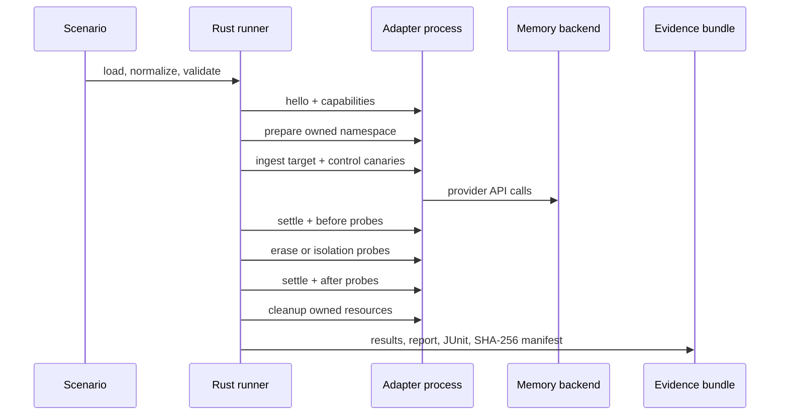

# MemoryProof architecture

[English](architecture.md) · [简体中文](architecture.zh-CN.md)

MemoryProof has a small trust boundary on purpose. The Rust process owns scenario parsing, capability negotiation, deterministic assertions, redaction, and evidence hashing. Provider-specific behavior stays behind an isolated Python process.

## Runtime flow



## Trust boundaries

| Boundary | Owner | Rule |
| --- | --- | --- |
| Scenario and assertion engine | Rust | No LLM output participates in the final decision. |
| Adapter process | Python | stdout is protocol-only; stderr is diagnostic. |
| Provider API | Adapter | Credentials come from the environment; request IDs may be recorded, secrets may not. |
| Evidence bundle | Rust filesystem | Paths are validated and checksums are sorted before the bundle hash is written. |
| Public matrix | CI + reviewed bundles | A bundle must verify before a profile is indexed. |

## Stable contracts

The scenario API is `memoryproof.dev/v1`; the adapter protocol is `memoryproof.adapter/v1`; the evidence format is `memoryproof.bundle/v1`. Every frame is one JSON object per line:

```json
{"protocol":"memoryproof.adapter/v1","id":"7","method":"probe","params":{"probe":{"fixture":"target","kind":"semantic"}}}
```

```json
{"protocol":"memoryproof.adapter/v1","id":"7","ok":true,"result":{"found":false}}
```

The response ID must match. A process crash, timeout, malformed JSON, protocol mismatch, or unsupported method becomes a standardized error. A missing backend capability becomes `SKIP` or `UNKNOWN`, never a fabricated `PASS`.

## Why the control fixture exists

The target fixture proves that deletion happened to something observable. The control fixture proves that the test did not accidentally delete the whole tenant, user, Agent, thread, or namespace. Scope is a first-class assertion, not an optional convenience.

## What the evidence hash means

`checksums.sha256` lists the declared bundle files in sorted order. `bundle.hash` is the SHA-256 hash of that exact checksum text. This proves post-run byte integrity; v1 does not claim signer identity, physical erasure, provider-log deletion, backup deletion, or model-weight unlearning.

## Adding a provider adapter

1. Add a dependency-free module under `python/forgetproof_adapters/`.
2. Advertise only capabilities that the provider exposes in the configured mode.
3. Create temporary resources with a unique run marker.
4. Refuse cleanup and scope deletion without ownership.
5. Add mock contract tests and a redacted public bundle.
6. Document provider-version semantics and the observable boundary in both README languages.

See [CONTRIBUTING.md](../CONTRIBUTING.md) for the contributor workflow and [SECURITY.md](../SECURITY.md) for remote-run safety.
