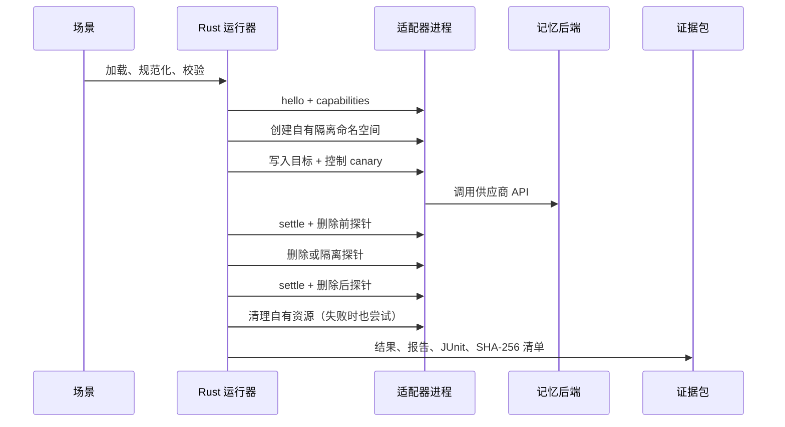

# MemoryProof 架构

[English](architecture.md) · [简体中文](architecture.zh-CN.md)

MemoryProof 刻意保持较小的信任边界。Rust 进程负责场景解析、能力协商、确定性断言、脱敏和证据哈希；供应商差异全部放在隔离的 Python 子进程之后。

## 运行流程



## 信任边界

| 边界 | 负责者 | 规则 |
| --- | --- | --- |
| 场景与断言引擎 | Rust | LLM 输出不能参与最终判定。 |
| 适配器进程 | Python | stdout 只允许协议帧，stderr 只写诊断日志；清理必须带所有权范围。 |
| 供应商 API | 适配器 | 凭据来自环境变量，可以记录安全的请求 ID，但不能记录密钥。 |
| 证据包 | Rust 文件系统 | 校验路径，并在写 bundle hash 前排序哈希清单。 |
| 公开矩阵 | CI + 审阅后的证据包 | 证据包必须先通过 verify，才能进入索引。 |

## 稳定契约

场景 API 是 `memoryproof.dev/v1`，适配器协议是 `memoryproof.adapter/v1`，证据格式是 `memoryproof.bundle/v1`。每一帧都是一行 JSON：

```json
{"protocol":"memoryproof.adapter/v1","id":"7","method":"probe","params":{"probe":{"fixture":"target","kind":"semantic"}}}
```

```json
{"protocol":"memoryproof.adapter/v1","id":"7","ok":true,"result":{"found":false}}
```

响应 ID 必须匹配。进程崩溃、超时、畸形 JSON、协议不匹配或不支持的方法都会变成标准错误；后端没有的能力会变为 `SKIP` 或 `UNKNOWN`，绝不会伪造 `PASS`。

Rust 运行器会在发送 `prepare` 前就启动带所有权范围的清理保护。如果供应商调用、协议帧或子进程在运行中途失败，终止子进程前还会向适配器发送最后一次 `cleanup`。远程 endpoint 覆盖项、`doctor` 和可选的 LLM 探针扩展也必须显式授权网络；本地 mock 的 loopback endpoint 仍可直接使用。

官方适配器会诚实区分可观察边界：Mem0 检查当前配置的记忆/实体路径，Letta 同时检查 archival passage 和临时 core-memory block，Zep 检查 episode 搜索和配置的 user graph。接口不可用时保持 `UNKNOWN`，不会静默当成空存储。

## 为什么需要控制 fixture

目标 fixture 证明删除之前确实存在可观察数据。控制 fixture 证明测试没有误删整个租户、用户、Agent、线程或命名空间。范围是一级断言，不是可有可无的附加项。

## 证据哈希代表什么

`checksums.sha256` 按排序顺序列出证据包声明的文件。`bundle.hash` 是这段完整清单文本的 SHA-256 哈希；它是权威 bundle hash，因为把哈希写入 `manifest.json` 会产生循环校验。它证明运行后文件字节没有被修改；v1 不声称证明签名者身份、物理擦除、供应商日志删除、备份删除或模型权重反学习。

## 添加供应商适配器

1. 在 `python/forgetproof_adapters/` 下添加无依赖模块。
2. 只声明当前配置模式真正暴露的能力。
3. 使用唯一运行标记创建临时资源。
4. 没有所有权时拒绝清理和范围删除。
5. 添加 mock 契约测试和脱敏的公开证据包。
6. 用中英文记录供应商版本语义和可观察边界。

贡献流程见[贡献指南](../CONTRIBUTING.zh-CN.md)，远程运行安全见[安全策略](../SECURITY.zh-CN.md)。
